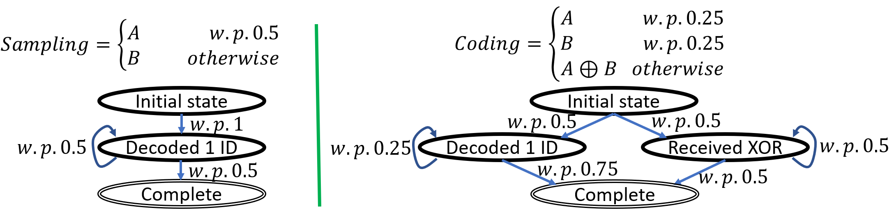
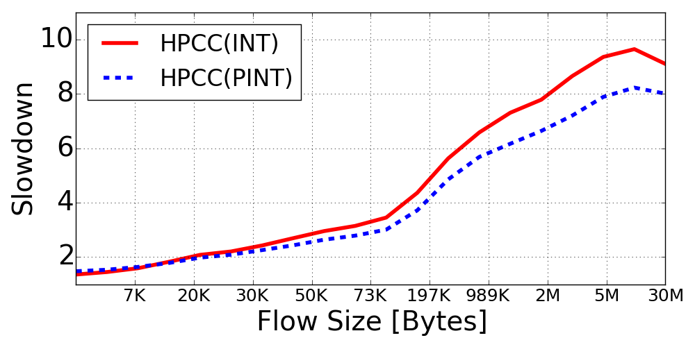
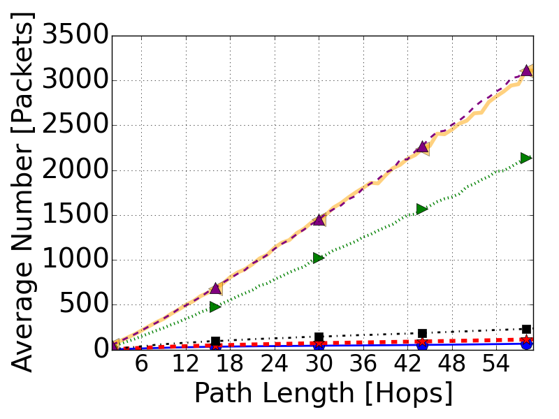
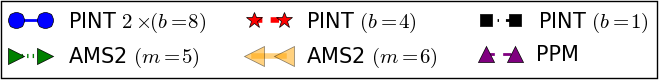

# PINT: Probabilistic In-band Network Telemetry

Modern switches come with the ability to collect telemetry -- information about the internal network status, including queue occupancy, latency measurements, and so on.  
This post presents a *probabilistic* approach to in-band network telemetry: a way to collect the data you care about while minimizing the number of overhead bits added to packets. It is based on our 
[ACM SIGCOMM 2020 paper](https://dl.acm.org/doi/abs/10.1145/3387514.3405894), 
 whose talk [is available here](https://www.youtube.com/watch?v=6Jsu9qtGXOM).

## Introduction
Network telemetry is a fundamental building block for various network functionalities such as congestion control, load balancing, and path tracing. 
A simple yet powerful approach for telemetry is provided by the *[In-band Network Telemetry (INT)](https://github.com/p4lang/p4-applications/blob/master/docs/telemetry_report_v1_0.pdf)* framework.
The main idea behind INT is to add the desired information (a.k.a. *telemetry metadata*) onto data packets (hence, it is called *in-band*).

Do you need to figure out the path taken by a flow? No problem; with INT, we can add the switch IDs into the INT header of the packet. 
How about discovering which switch had full buffers and caused high latency? Easy, with INT, we write the buffer occupancy on the packet for each hop.

In fact, INT is already widely supported by switches such as [Barefoot Tofino](https://barefootnetworks.com/products/brief-tofino/) and [Broadcom BCM56870 Series](https://www.broadcom.com/products/ethernet-connectivity/switching/strataxgs/bcm56870-series), and is used in state-of-the-art congestion control algorithms such as [HPCC](https://dl.acm.org/doi/10.1145/3341302.3342085).

Before diving into PINT, we start by introducing INT.

### INT and its Packet Overhead

INT collects network data plane status at switches, without requiring any control plane intervention. Designated INT sources (e.g., the end-host networking stack, NICs, or ingress switches) add an INT *metadata header* to packets, telling the other hops along the path what information we are collecting.
Each hop reads the header, determines what we are collecting (e.g., switch IDs, if we want to discover the path), and *adds* its own information to the packet.

Since INT encodes *per-hop* information, the overall overhead grows linearly in the path length and in the number of data values collected.
For example, the HPCC congestion control algorithm collects three different values (timestamp, egress port tx utilization, and queue occupancy) at each hop.
According to the spec, the metadata header is 8 bytes, and another 4 bytes of information are added at every hop *for each collected metadata value*.  This can pose a significant overhead, especially when collecting multiple metadata values and in large-diameter topologies.

#### Why should we care about this overhead?
INT generates a lot of information that is added to packets. This overhead has several drawbacks:

- **Reducing network goodput:**
INT aims to be transparent to the user; the packets each flow may send must be smaller than the network MTU to allow adding the INT information without fragmenting the packets.
In our experiments, this translated to up to 25\% increase in flow complication time and up to 20\% lower latency. The overhead also increases the overall network traffic and the packet processing time at switches. Moreover, the large amounts of data produced by INT pose significant network and processing overheads for its collection.

- **Increasing switch processing time:** 
Switches have a fixed rate for processing each bit of traffic. The INT information increases the processing time and end-to-end latency. In our calculation, this can translate to a 1-2% latency increase per metadata value on a 10G link.

- **High collection overheads:** 
The information that PINT generates needs to be collected and processed. Due to the sheer amount of information, this poses a challenge for both the network and the processing servers.

### PINT to the Rescue

Given the costs described above, you are probably asking, how can we collect the desired information while reducing the overhead from INT?
Well, we can't -- unless we change what we mean by the desired information.  

Our insight is that for most applications, we do not actually need to collect all per-packet per-hop values, but only *aggregates* of this data. 
For example, if we wish to verify that a flow's path conforms with the operator policy (e.g., follows an NFV chain, passes through a firewall, etc.), it is enough to infer the path from a collection of the packets.
Therefore, PINT uses a variety of probabilistic methods such as sampling, hashing, and randomized coding, to reduce the amount of data added to each packet.

### PINT's Techniques

PINT minimizes the overhead added to packets via approximation and probabilistic techniques. 
To that end, we use several core techniques:

#### Global Hash Functions: 
We want PINT to allow running multiple queries concurrently. 
However, unlike in INT, we want the overhead to be bounded by the user-defined threshold and not compounded when queries are added.
Therefore, PINT selects a query subset to run on each packet. The switches, without communication, achieve implicit coordination by picking the subset by applying the same hash function on the packet ID.

#### Probabilistic numeric approximation
Suppose we wish to collect latency/queue measurements using PINT. The current standard would use 32-bit  for each collected value at each hop. What if we wanted to use fewer (e.g., 8) bits? PINT compresses the value while ensuring bounded error (e.g., 10\%). Further, we apply randomized rounding to make sure that in expectation, we collect the right number. This way, the collector can average over multiple packets and get an accurate estimation.

#### Coding
Suppose we want to infer the path taken by a flow. INT supports such functionality by writing all switch IDs along the path onto packets. What if we want to limit the overhead, say, to one identifier?
An intuitive idea is to use sampling. By writing a sampled identifier from the path, we can collect the entire path after getting enough samples.
However, the number of packets needed by such an approach may be quite large. In PINT, we use *coding* to reduce this number. 

For an intuition, consider trying to get a path of two hops, with IDs $A$ and $B$: .
If each packet *samples* an ID from the path, we would, in expectation, need three packets to get both identifiers. This is because the first packet would carry some ID (e.g., $A$), and this ID is equally likely to appear again in each consecutive packet. Therefore, we would need two packets on average until we get the second ID.

In contrast, consider an algorithm that uses this sampling with probability 50%, and otherwise writes the bitwise-xor of both IDs. That is, each packet has a probability of 25% to carry the ID $A$, 25% to have $B$, and 50% to have $A\oplus B$. 
This modification reduces the expected number of packets we require to $8/3$. 
For example, if the first packet carried $A$, we have a probability of 75% of inferring $B$ in each consecutive packets. This is because we get B itself w.p. 25%, and A$\oplus$B with 50%. When getting $A\oplus B$, we can get $B$ from $A\oplus(A\oplus B)$ since we already know A.

>
> The decoding state of both techniques. 

### What can PINT do?
PINT reduces the overheads of collecting telemetry information.
As an example of PINT's capabilities, we replace INT by PINT in the state of the art congestion control algorithm, [HPCC](https://dl.acm.org/doi/10.1145/3341302.3342085). 

HPCC uses INT to collect *per-packet* utilization and queue occupancy statistics. When a packet makes it to the end host, it uses the statistics to fine-tune the sending rate in an attempt to prevent congestion and improve network metrics such as goodput and flow completion time. 
Our observation is that HPCC relies on the *bottleneck* of the packet's path to determine the sending rate. Therefore, if the switches compute its congestion signal, it is enough for HPCC to get information about the maximal congestion the packet observed.
Specifically, PINT tracks the maximum congestion signal while compressing the value to the user-defined overhead. Here, the congestion signal is an *approximated* form of the HPCC rate formula that allows us to compress the value into fewer bits. Moreover, we use *randomized rounding* so that in expectation, we would convey the exact congestion signal to the end host. This way, the error is averaged over multiple packets, allowing the sender to reach the correct transmission rate. Finally, we show that HPCC does not need *every packet* to convey the congestion feedback; thus, PINT can only probabilistically (e.g., once in every sixteen packets) add the congestion information, which frees the other packets for additional queries.
As a result, we get comparable or better congestion control, using a tiny fraction of the overhead used in HPCC. The reduced overhead then results in improved performance, especially on long flows that can send their data using fewer packets.
>

A second example application is path tracing, where we simply want to discover the path taken by the flow.  Let us assume the path stays fixed over a reasonable amount of time.  PINT discovers the path by encoding it on multiple packets. Roughly speaking, each packet carries information about a subset of the switches along the path, so that PINT can decode all hops from a small collection of packets.
between packets) such as switch IDs as we can "spread" the information between a bunch of packets.  
Indeed, this is a *coding* problem, and PINT solves it using a distributed coding scheme where the switches encode the path information without communication.
Using some additional tricks, we can also identify when a path changes and even support multipath protocols such as Multipath TCP. 
Trying to trace paths while minimizing the per-packet overhead is not new and dates back to 2000. Nonetheless, our distributed encoding schemes require significantly fewer packets to infer the path, even when using just $b$=1 overhead bit per packet!
>

>
>
>PINT reduces the #packets needed to decode the path using fewer than the 16 per-packet bits used by the alternatives.
>

### Conclusion

PINT is a probabilistic framework to in-band telemetry that provides similar visibility to INT while bounding the per-packet overhead to a user-specified value. This is important because overheads imposed on packets translate to inferior flow completion time and application-level goodput. PINT handles a variety of queries and supports both packet-level and flow-level aggregations. In the paper, we have proven performance bounds and provide an in-depth overview of the aggregation techniques.
